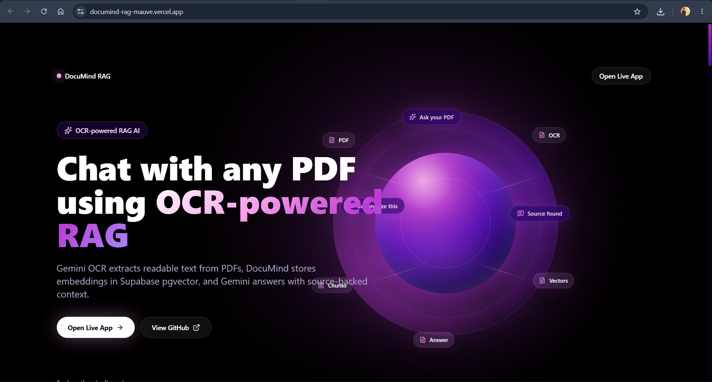
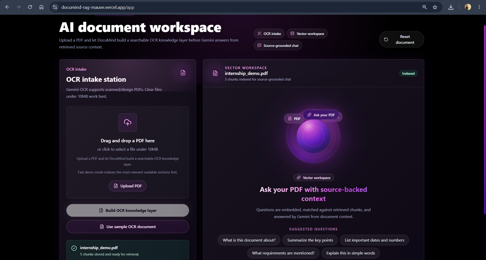
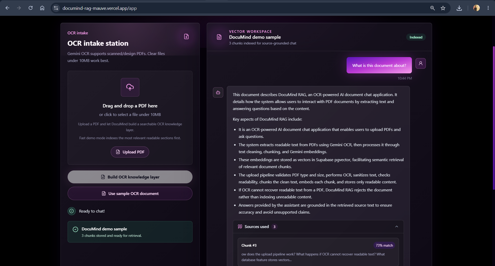
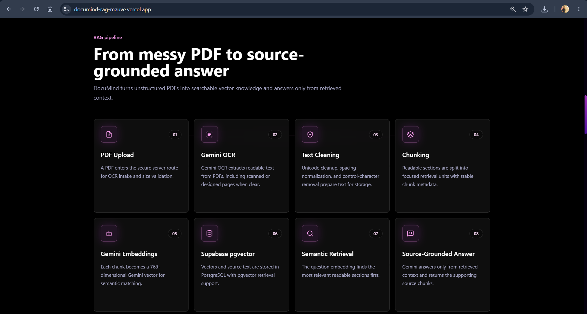
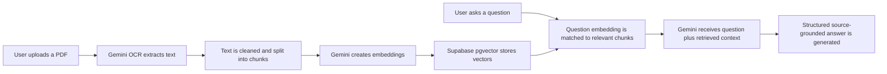

# DocuMind RAG — AI Document Intelligence Assistant

A full-stack AI document assistant that lets users upload documents, ask questions, retrieve relevant context, and generate structured answers using Retrieval-Augmented Generation.

DocuMind RAG focuses on PDF-based document Q&A with Gemini OCR, Gemini embeddings, Supabase pgvector retrieval, and a polished source-backed chat workspace.

## Live Demo

Live Demo: [https://documind-rag-mauve.vercel.app/](https://documind-rag-mauve.vercel.app/)

App Workspace: [https://documind-rag-mauve.vercel.app/app](https://documind-rag-mauve.vercel.app/app)

## Key Features

- PDF upload with file type, empty file, and 10MB size validation
- Gemini-powered OCR for extracting readable text from PDFs
- Text sanitization and readability checks before indexing
- Chunk-based document processing for retrieval
- Gemini embeddings with 768-dimensional vectors
- Supabase PostgreSQL storage with pgvector semantic search
- Ask questions from an uploaded document
- Context-aware Gemini answer generation from retrieved chunks
- Source/context preview with chunk-level match scores
- Summary-style and bullet-point answers when requested
- Chat-style Q&A interface with suggested prompts
- Sample OCR document flow for quick demos
- Responsive dark dashboard UI
- Loading states, empty states, and user-friendly error handling

## Tech Stack

- Next.js 14 App Router
- React 18
- TypeScript
- Tailwind CSS
- Framer Motion
- Lucide React
- Gemini API via `@google/genai`
- `gemini-2.5-flash` for OCR and answer generation
- `gemini-embedding-2` for document and query embeddings
- Supabase JavaScript client
- Supabase PostgreSQL with pgvector
- `pdf-parse` for debug/local extraction helpers
- Vercel

## Screenshots

The repository includes current project screenshots in `./screenshots`. Additional captures for `rag-answer.png` and `dashboard.png` can be added when final states are available.









## How It Works



1. User uploads a PDF.
2. Gemini OCR extracts readable text.
3. Content is sanitized and split into smaller chunks.
4. Each chunk is embedded with Gemini.
5. Chunks and vectors are stored in Supabase pgvector.
6. User questions are embedded and matched with relevant document chunks.
7. Gemini receives the question plus retrieved context.
8. The assistant returns a structured answer with source previews.

## RAG Workflow

Retrieval-Augmented Generation keeps the answer grounded in document content instead of relying on the model's general knowledge.

- Documents are processed into smaller chunks.
- User questions are matched with relevant document context through vector similarity.
- Gemini generates the final response from the retrieved context.
- The assistant is prompted to avoid unsupported claims and say when the answer is not present in the document.
- Source chunks are returned with match scores so users can inspect the context used.

## Environment Variables

Create a `.env.local` file with the variables used by the app:

```bash
GEMINI_API_KEY=
NEXT_PUBLIC_SUPABASE_URL=
SUPABASE_SERVICE_ROLE_KEY=
```

Security notes:

- Do not commit `.env.local`.
- `GEMINI_API_KEY` and `SUPABASE_SERVICE_ROLE_KEY` must stay server-side.
- Add the same environment variables in Vercel before deployment.
- `NEXT_PUBLIC_SUPABASE_URL` is public project metadata, but the service role key is secret.

## Local Setup

```bash
npm install
npm run dev
npm run build
```

Open [http://localhost:3000](http://localhost:3000) for the landing page or [http://localhost:3000/app](http://localhost:3000/app) for the document workspace.

## Supabase Setup

1. Create a Supabase project.
2. Enable the `vector` and `pgcrypto` extensions.
3. Run `supabase/schema.sql` in the Supabase SQL editor.
4. Add the Supabase project URL and service role key to `.env.local`.
5. Restart the development server.

## Usage

1. Open the app workspace.
2. Upload a clear PDF under 10MB or use the sample OCR document.
3. Wait for OCR, chunking, embedding, and storage to complete.
4. Ask a question about the uploaded document.
5. Review the structured answer and inspect retrieved source chunks when available.

## Deployment

The project is deployed on Vercel:

[https://documind-rag-mauve.vercel.app/](https://documind-rag-mauve.vercel.app/)

Before deploying your own copy, add `GEMINI_API_KEY`, `NEXT_PUBLIC_SUPABASE_URL`, and `SUPABASE_SERVICE_ROLE_KEY` in the Vercel project environment settings.

## Project Status

Production-style portfolio project / active development.

The current demo indexes the first readable chunks for a fast portfolio workflow. Clear PDFs work best; blurry scans or unreadable files may be rejected.

## Future Improvements

- Multi-document chat
- Better source citations
- PDF page-level references
- Document history
- User authentication
- Vector database tuning for larger documents
- Export answers as PDF or Markdown
- Advanced file type support
- Team workspace support
- Evaluation metrics for RAG accuracy

## License / Portfolio Note

This project is built for learning, portfolio, and AI document intelligence workflow demonstration.
