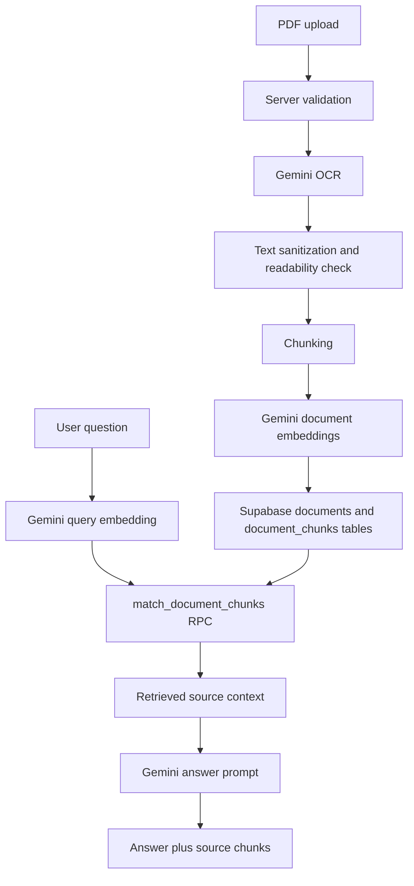

# DocuMind RAG Architecture

## Product Overview

DocuMind RAG is a full-stack AI document assistant for PDF-based question answering. Users upload a PDF, the app extracts readable text with Gemini OCR, stores retrieval chunks in Supabase pgvector, and generates answers from retrieved document context.

The project is designed as a portfolio-ready Retrieval-Augmented Generation workflow, with a polished dashboard, chat interface, source previews, and clear failure states for unsupported or unreadable files.

## RAG Workflow



## Document Processing Flow

1. The user uploads a PDF through the workspace UI.
2. `/api/upload` validates file type, file size, and empty files.
3. Gemini OCR extracts visible readable text from the PDF.
4. The extracted text is sanitized for storage.
5. Readability checks prevent unusable OCR output from being indexed.
6. `chunkText` splits clean text into retrieval chunks.
7. The current demo indexes a limited number of readable chunks for speed.
8. Gemini creates a 768-dimensional embedding for each chunk.
9. Chunks and embeddings are inserted into Supabase.

## API Flow

- `POST /api/upload` handles PDF intake, OCR, chunking, embeddings, and storage.
- `POST /api/chat` validates a question and document ID, embeds the question, retrieves matching chunks, and asks Gemini to answer from context.
- `POST /api/demo-document` creates a sample document for quick demos.
- `POST /api/debug-pdf` and `POST /api/debug-ocr` are development/debug helpers and are blocked in production.

## Storage and Database Flow

The Supabase schema in `supabase/schema.sql` creates:

- `documents`: stores document metadata such as name, size, and chunk count.
- `document_chunks`: stores chunk text, character offsets, chunk index, and vector embeddings.
- `match_document_chunks`: a SQL RPC function that compares the query embedding against stored chunk embeddings using pgvector cosine distance.

The app uses `SUPABASE_SERVICE_ROLE_KEY` only on the server so upload and retrieval routes can write documents and run vector search securely.

## Gemini Integration

Gemini is used for three core tasks:

- OCR: `gemini-2.5-flash` extracts readable PDF text.
- Embeddings: `gemini-embedding-2` creates document and question vectors with 768 dimensions.
- Answer generation: `gemini-2.5-flash` receives the question plus retrieved chunks and returns a polished answer.

The chat prompt instructs the model to answer only from retrieved context, avoid outside knowledge, and say when the answer is not available in the document.

## Environment Variable Setup

Required variables:

```bash
GEMINI_API_KEY=
NEXT_PUBLIC_SUPABASE_URL=
SUPABASE_SERVICE_ROLE_KEY=
```

Keep `.env.local` out of Git. Add the same values to Vercel before deployment. The Gemini key and Supabase service role key must remain server-side.

## Deployment Notes

The app is ready for Vercel deployment. Production deployments need:

- Supabase schema applied before upload/chat testing
- `GEMINI_API_KEY` configured in Vercel
- `NEXT_PUBLIC_SUPABASE_URL` configured in Vercel
- `SUPABASE_SERVICE_ROLE_KEY` configured in Vercel
- Node.js runtime support for PDF upload handling

## Future Improvements

- Multi-document chat
- User authentication
- Persistent chat history
- Page-level citations
- Background indexing for larger documents
- Streaming responses
- Export answers as PDF or Markdown
- RAG quality evaluation metrics
